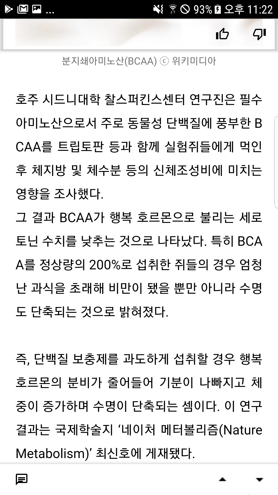

# RKIVE Mobile Application Specification

RKIVE Mobile App UX/UI spec

## RKIVE View

RKIVE View는 RKiver가 카테고리로 묶은 Web page URL 링크 리스트를 보여주는 화면이다. 

>Sample View:
>
>
>
>

RKIVE View에 표시될 정보:

* RKive 정보
  * 아카이브 명
  * 아카이브 설명
  * 아카이버 정보(프로필, 닉네임)
  * 좋아요/싫어요 수
  * 구독자 수
  * 내 구독 여부
  * 내 알림 여부
  * 내 좋아요/싫어요 여부

* 링크 목록
  * 링크 제목(Title)
  * 링크 미리보기(Description)
  * 링크 이미지 URL
  * 링크 등록 일자(~분 전)
  * 좋아요/싫어요 수
  * 조회수
* 댓글
  * 댓글 작성 영역
  * 댓글 작성자 정보(프로필, 닉네임)
  * 댓글 내용
  * 댓글 작성 일자(~분 전)
  * 댓글 좋아요/싫어요 수
  * 내 좋아요/싫어요 여부
  * 대댓글

Functions:

* RKive 정보 수정
* RKive 좋아요/싫어요
* RKive 구독 설정/해제
* RKive 알람 설정/해제
* RKive 공유
* 링크 CRUD 
* 댓글 CRUD
* 링크/댓글 검색

**IDEA**

* 링크 리스트 다음으로 댓글 리스트가 이어진다. 이 때, 마지막 링크 다음에서 댓글 영역에 들어갈 때 앱 하단에 Bottom Appbar가 올라오며 댓글을 달 수 있다.
* 링크 목록은 순서가 존재한다. 아카이버는 링크의 보관 순서를 관리할 수 있다.

## Add Link View

RKIVE 플랫폼에서 중심이 되는 활동은 링크를 RKIVE에 수집하는 것이다. 따라서, 사용자는 다양한 상황에서 최대한 쉽고  빠르게 웹 문서의 링크를 자신이 원하는 RKIVE에 등록할 수 있어야 한다.

링크 등록은 웹 내부와 외부로 나뉜다:

* 크롬, 사파리 등 웹 브라우저에서 현재 화면 링크 등록하기 (External)
* RKIVE 앱에서 링크 주소 등록 (Internal)
  * 외부에서 찾은 링크 주소 등록
  * 다른 RKIVE로부터 링크 담기

## RKIVE LIST View

RKIVE item

* RKIVE 명
* 대표 이미지
* 보관 링크 수
* 최근 업데이트 시간(~분 전)
* 공개 수준 구분 (public, private 등 - 아이콘으로 구분도 가능)
* 구독자 수 (선택사항)
* 관계? 구분(내 아카이브, 구독 중, 그룹 등)

## Create RKIVE View 

## Web Page View

아카이빙된 링크 사이트를 보여주는 화면

> Sample View:
>
>  

* 아카이버 노트
* 댓글
* 좋아요/싫어요
* 공유
* 페이지 URL 주소 복사
* 내 아카이브에 담기
* 페이지 내 텍스트 검색
* 다음 페이지와 스크롤로 연결

사용자는 아카이브 내 현재 문서에서 다른 문서로 쉽게 이동할 수 있어야 한다. 

사용자는 현재 문서내 텍스트 검색이 가능해야 한다.

## RKIVE SEARCH